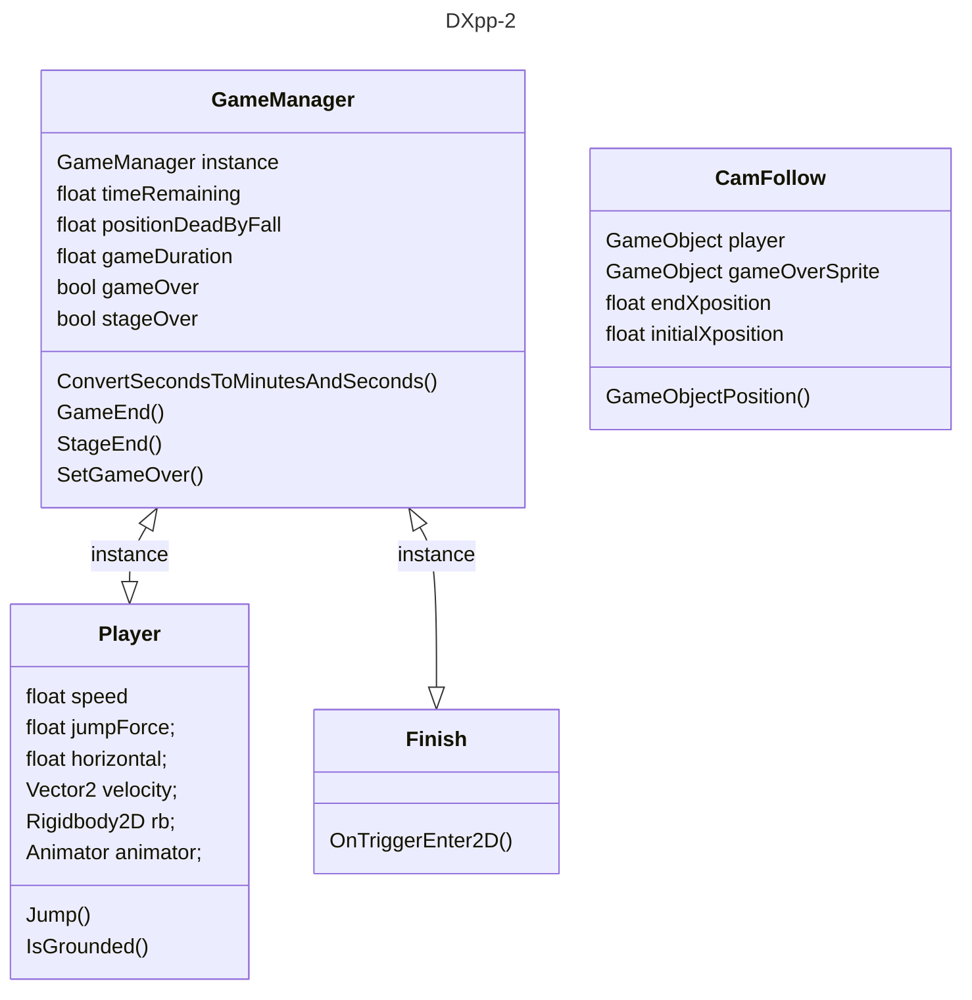

# Implementación del juego 0.01
## indrodución
Juego de plataformas 2d el objetivo del juego sera llegar a la meta antes que se acabe el tiempo
___
## Implementación

+ GameManager
  - sera el encargado de controlar el tiempo de juego y si se queda sin tiempo sera el encargado de sacar la pantalla de GameOver.
+ Player
  - tiene el movimiento del jugador en los ejes X y Z así como la velocidad en la que se mueve y la fuerza del salto.
+ CamFollow
  - se encargara de seguir al gameobject del player a través del nivel.
+ Finish
  - contiene un trigger que si el jugador atraviesa mandara un true al GameManager para indicar que ha llegado a la meta.

___
## Diseño
para esta primera versión  el escenario sera una plataforma de 20 unidades y cada diez un hueco. y al final la meta.
## GUI
en la parte arriba a la derecha saldrá el tiempo restante para llegar a la meta
